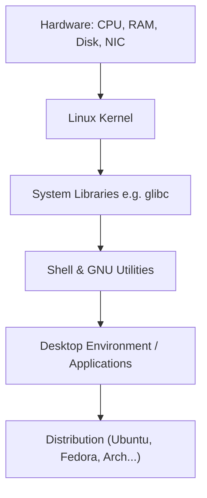

# 01 — Introduction to Linux & the Kernel

[⬅ Back to course outline](../README.md) | Next: [Filesystem Hierarchy ➡](02-filesystem-hierarchy.md)

## What is Linux?

Linux is a free, open-source **operating system kernel** originally created by **Linus Torvalds** in 1991. Strictly speaking, "Linux" refers only to the kernel — the core program that manages hardware and system resources. What most people call "Linux" (Ubuntu, Fedora, Arch, Debian, etc.) is actually **GNU/Linux**: the Linux kernel bundled with the GNU tools (shell, compilers, utilities) and other software to form a complete, usable operating system — a **distribution** (or "distro").

## Kernel vs. Operating System vs. Distribution

- **Kernel**: The core program running at the lowest level, talking directly to hardware. It manages the CPU, memory, devices, and enforces isolation between processes.
- **Operating System**: Kernel + system libraries + basic utilities needed to actually run programs.
- **Distribution**: A complete, packaged OS built around the kernel, adding a package manager, default apps, desktop environment, installer, etc.

## What does the kernel actually do?

The kernel is the layer between user programs and physical hardware. Its core responsibilities:

| Responsibility | Description |
|---|---|
| **Process management** | Creates, schedules, and terminates processes; decides which process gets CPU time and when (the scheduler). |
| **Memory management** | Allocates/frees RAM to processes, handles virtual memory and swapping. |
| **Device drivers** | Provides a uniform interface to interact with disks, network cards, USB devices, etc. |
| **Filesystem management** | Implements how data is stored/retrieved on disks (ext4, xfs, btrfs, etc.) and exposes it as files and directories. |
| **Networking** | Implements the network stack (TCP/IP) so programs can communicate over a network. |
| **System calls (syscalls)** | The API programs use to ask the kernel to do privileged work (open a file, fork a process, send data over a socket). |

### User space vs. Kernel space

- **Kernel space**: Privileged mode where the kernel and drivers run, with full hardware access.
- **User space**: Where normal applications (your shell, browser, editor) run, with restricted access. Applications must ask the kernel (via syscalls) to do anything privileged, like reading a file or opening a network connection.

This separation is a security boundary — a bug or crash in a user-space app shouldn't be able to take down the whole system.

## A brief history

- **1969**: Unix is created at Bell Labs.
- **1983**: Richard Stallman launches the **GNU Project** to build a free Unix-like OS, producing tools like `bash`, `gcc`, and `glibc` — but lacking a kernel.
- **1991**: Linus Torvalds, a Finnish student, releases the first Linux kernel as a hobby project.
- **Linux kernel + GNU tools** = a complete, free operating system: GNU/Linux.
- Since then, thousands of contributors and companies (Red Hat, Canonical, SUSE, Google, Microsoft, etc.) have contributed to the kernel and surrounding ecosystem.

## Popular distributions (distros)

| Distro family | Examples | Package format | Package manager |
|---|---|---|---|
| Debian-based | Debian, Ubuntu, Linux Mint | `.deb` | `apt`, `dpkg` |
| Red Hat-based | Fedora, RHEL, CentOS, Rocky, Alma | `.rpm` | `dnf`, `yum` |
| Arch-based | Arch Linux, Manjaro | binary/source | `pacman` |
| SUSE-based | openSUSE, SLES | `.rpm` | `zypper` |
| Independent | Alpine, Gentoo, NixOS | varies | `apk`, `emerge`, `nix` |

## Why learn Linux?

- Powers the majority of web servers, cloud infrastructure (AWS, GCP, Azure), and almost all supercomputers.
- The default environment for DevOps, backend development, embedded systems, and cybersecurity.
- Android is built on the Linux kernel.
- Free, transparent, and highly customizable.

## Key terms you'll see throughout this course

- **Shell**: The command-line interpreter (e.g. `bash`, `zsh`) that reads your commands and asks the kernel to execute them.
- **Terminal**: The program/window you type commands into (it hosts a shell).
- **Root**: The superuser account (`root`) with unrestricted access to the whole system.
- **Superuser / sudo**: `sudo` lets a normal user run a command with root privileges temporarily.

---
Next: [02 — Filesystem Hierarchy Standard ➡](02-filesystem-hierarchy.md)
